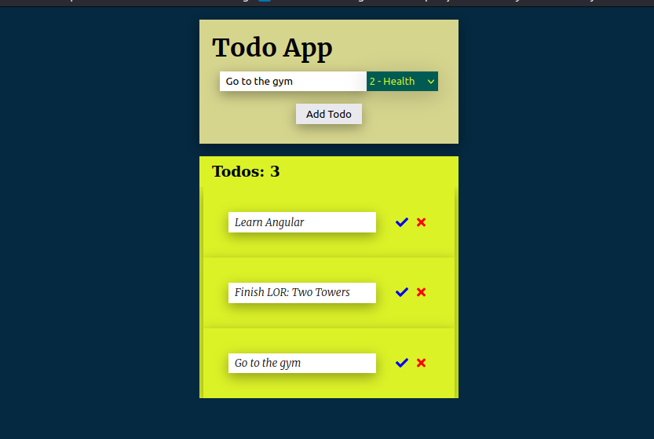

# TodoList

This project was generated with [Angular CLI](https://github.com/angular/angular-cli) version 14.2.5.

## Welcome 👋

This is my very first project using Angular. I started this project with the intention of starting my studies with web frameworks and also improving the todo app i've done using vanilla js

## Overview
The first project version used localstorage to save the whole operation, but I changed everything to use an API made with FastAPI, in the beginning the api wasn't connected to any database, the data was inside the api itself, but now all the entire operations is saved in a postgres database

I didn't deploy the api yet and i'm not sure if i will do that, but if you want to take a look, here it's:
[Todo-API](https://github.com/Thiagovasc/Todo-API)

## Project status:

- [ ] Style (In Progress);
- [ ] Responsive (In Progress);
- [x] Input validation;
- [x] Form Builder;
- [x] Add Task Component;
- [x] Todo Content Component;
- [x] TodoList Component;
- [x] API Dedicated;
- [x] API Consuming;
- [x] Get all todos Endpoint;
- [x] Delete Todo by Id Endpoint;
- [x] Create Todo Endpoint;
- [x] Finishing Todo Endpoint;
- [x] Deploy on GH Pages;
- [ ] LocalStorage & API - Database